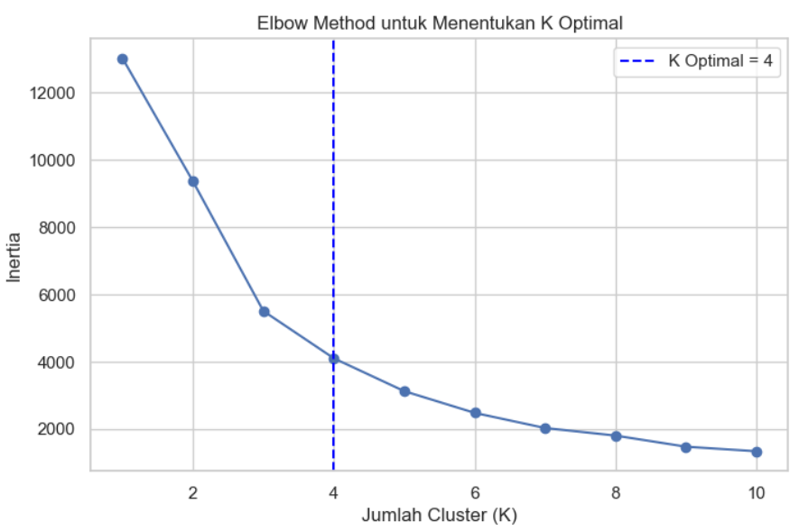
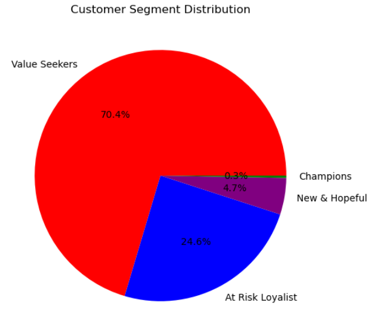
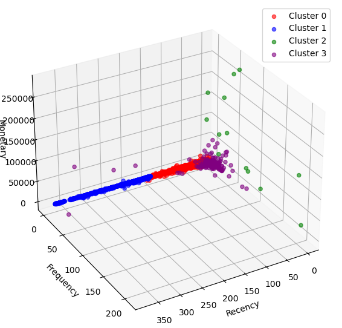
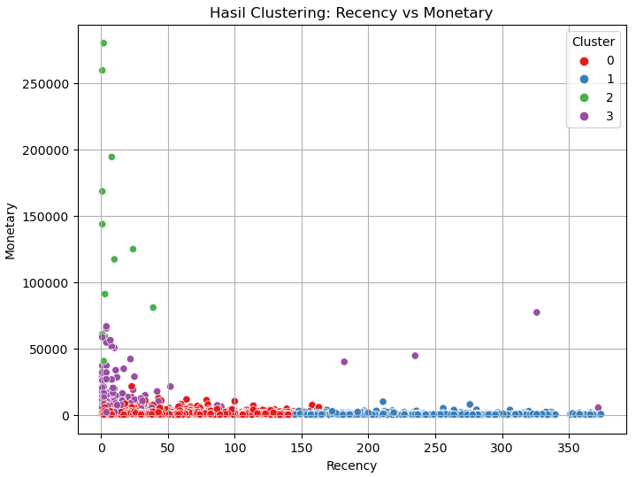

# 🛍️ Customer Segmentation using RFM Analysis and K-Means Clustering

## 📌 Deskripsi Proyek

Proyek ini bertujuan untuk melakukan segmentasi pelanggan dari data transaksi retail menggunakan metode **RFM (Recency, Frequency, Monetary)** dan algoritma **K-Means Clustering**. Tujuan akhirnya adalah untuk mengidentifikasi kelompok pelanggan yang memiliki karakteristik berbeda sehingga dapat dijadikan dasar strategi pemasaran yang lebih tepat sasaran.

Metode ini sangat berguna dalam dunia bisnis karena memungkinkan perusahaan untuk memfokuskan upaya marketing kepada pelanggan yang paling bernilai, serta mendesain program retensi bagi pelanggan yang berisiko tidak kembali.

---

## 📁 Dataset

Dataset yang digunakan adalah **Online Retail Dataset**, yang berisi lebih dari 500 ribu transaksi penjualan dari sebuah perusahaan e-commerce Inggris. Kolom yang tersedia antara lain:
- `InvoiceNo`
- `StockCode`
- `Description`
- `Quantity`
- `InvoiceDate`
- `UnitPrice`
- `CustomerID`
- `Country`

Sumber dataset: [UCI Machine Learning Repository / Kaggle](https://archive.ics.uci.edu/ml/datasets/online+retail)

---

## 🔍 Tahapan Analisis

1. **Data Cleaning**
   - Menghapus data dengan nilai Quantity dan UnitPrice negatif
   - Menghapus CustomerID yang kosong
   - Menghilangkan duplikat
   - Menambahkan kolom TotalPrice (Quantity × UnitPrice)

2. **Exploratory Data Analysis (EDA)**
   - Distribusi Quantity dan Price
   - Tren transaksi per hari
   - Transaksi per negara
   - Produk terlaris
   - Top customer

3. **RFM Calculation**
   - Menghitung nilai Recency, Frequency, dan Monetary berdasarkan CustomerID

4. **Transformasi & Normalisasi**
   - Transformasi log pada Frequency & Monetary (karena skewed)
   - Normalisasi semua nilai RFM menggunakan StandardScaler
   - Membalik nilai Recency (agar semakin besar = semakin baik)

5. **Clustering Evaluation**
   - Menentukan jumlah cluster optimal menggunakan Elbow Method & Silhouette Score

6. **K-Means Clustering**
   - Segmentasi pelanggan berdasarkan nilai RFM
   - Menambahkan label cluster ke dataset

7. **Visualisasi**
   - Scatter Plot 2D & 3D
   - Pie chart distribusi pelanggan
   - Heatmap RFM per cluster

8. **Interpretasi Segmen**
   - Champions
   - Value Seekers
   - At Risk Loyalist
   - New & Hopeful

---

## 📊 Contoh Output Visualisasi

| 📈 | 📊 |
|----|----|
|  |  |
|  |  |

---

## 💡 Insight Bisnis

Dengan memanfaatkan segmentasi ini, perusahaan dapat:
- Memberikan penghargaan khusus kepada **Champions**
- Meningkatkan nilai transaksi **Value Seekers**
- Mengembalikan **At Risk Loyalists**
- Mengedukasi dan menjaga keterlibatan **New & Hopeful**

---

## 🛠️ Tools dan Library

- Python (Jupyter Notebook)
- Pandas, Numpy
- Matplotlib, Seaborn, Plotly
- Scikit-learn
- Missingno

---

## 👤 Author

> **Febriansyah**  
> [GitHub](https://github.com/Fbriansyahh) | [LinkedIn](www.linkedin.com/in/febriansyah-ti) | [Email](febriansyah1467@gmail.com)

---

## 📁 Lisensi

Proyek ini bersifat open-source dan bebas digunakan untuk keperluan pembelajaran, dengan mencantumkan atribusi yang sesuai.

